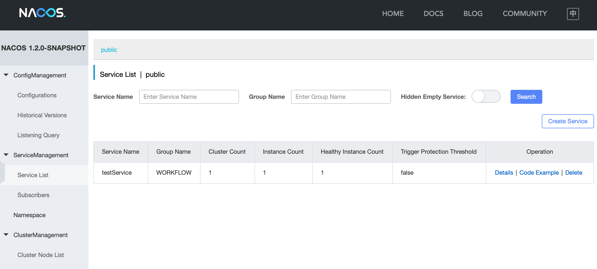
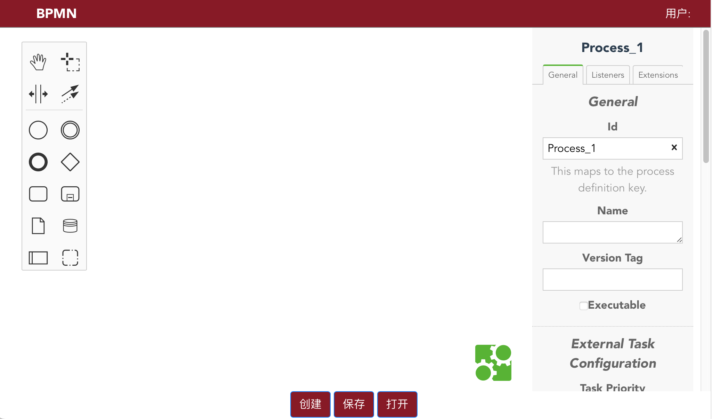
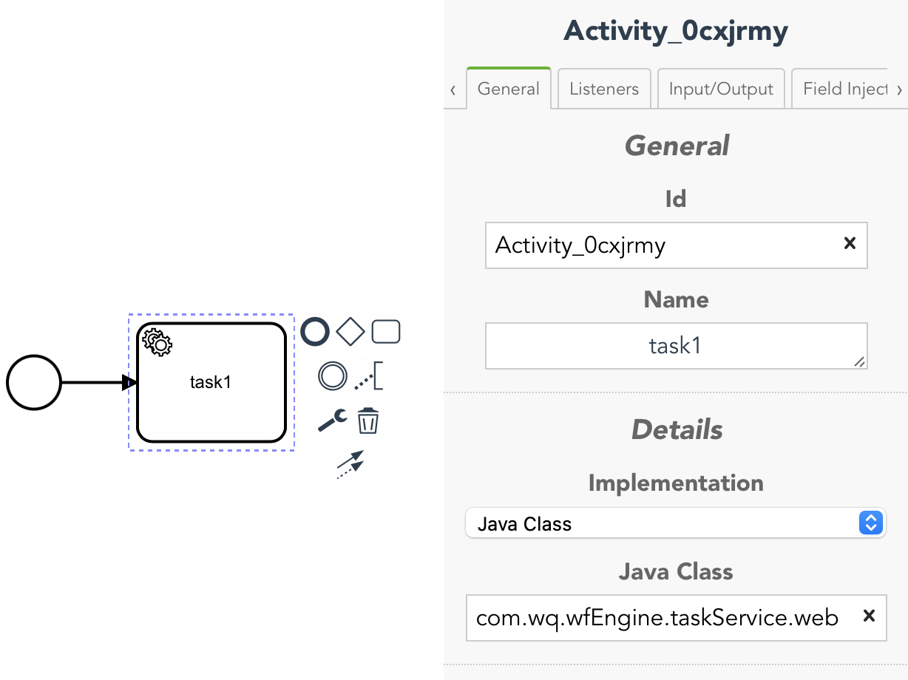
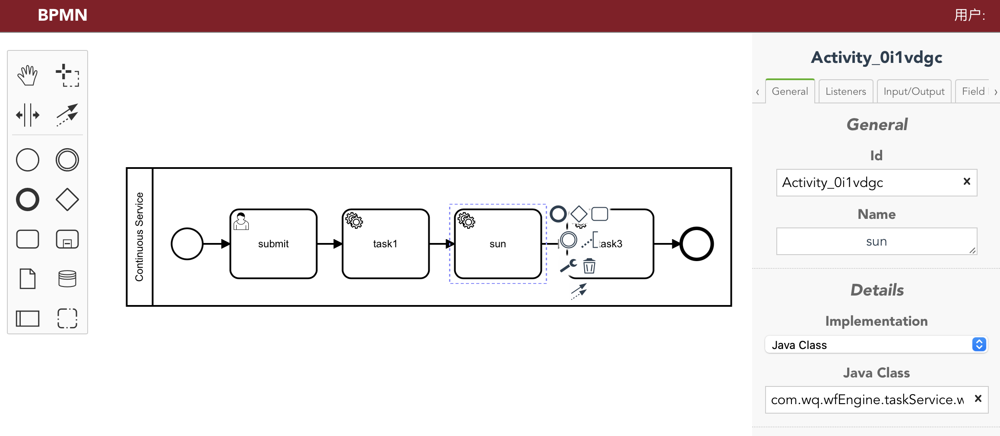

# Introduction

An Efficient Customized Blockchain System for Inter-Organizational Processes

 

We construct a blockchain system by embedding the customized process engine into the blockchain nodes based on a permissioned blockchain platform Hyperledger Fabric and a process engine Activiti. The customized process engine executes the inter-organizational business processes via a blockchain-style procedure, i.e., checking the validity of transactions, adding the valid transactions into the blockchain through the consensus mechanism, and then updating the process states according to the committed transactions.

 

For more information, please see this paper:

 

Puwei Wang, Zhouxing Sun, Rui Li et al., An Efficient Customized Blockchain System for Inter-Organizational Processes, IEEE International Conference on Web Services, pages 615-625, 2023


# Prerequisites and setup

\* [Docker](https://www.docker.com/products/overview) - v 20.10.7 or higher

\* [Docker Compose](https://docs.docker.com/compose/overview/) - v1.27.4 or higher

\* **Node.js** v8.17.0 

\* **Java** 1.8

\* [Download Docker images] 

​		hyperledger/fabric-orderer:1.4

​		hyperledger/fabric-zookeeper:x86_64-0.4.6

​		hyperledger/fabric-kafka:x86_64-0.4.6


# How To Use

## 1. Load our docker images

```shell
cd workflow-engine
docker load -i workflow-peer-v2
docker load -i workflow-ca
```

**note:**

* The **workflow-peer-v2** image not only includes the Fabric peer, but also encompasses **Redis**, **IPFS**, and **MySQL** services.


## 2. Launch the blockchain system

### 2.1 Launch the network using docker-compose

```shell
cd workflow-engine
docker-compose -f workflow.yaml up
```

* Once you have completed the above setup, you will have provisioned a local network with the following docker container configuration:

```
* 3 CAs
       IMAGE                                  NAMES
workflow-ca:1.0                         ca.org3.workflow.com
workflow-ca:1.0                         ca.org2.workflow.com
workflow-ca:1.0                         ca.org1.workflow.com

* An orderer with a kafka node and a zookeeper node
       IMAGE                                  NAMES
hyperledger/fabric-orderer:1.4.0           orderer.workflow.com
hyperledger/fabric-kafka:x86_64-0.4.6       kafka.workflow.com
hyperledger/fabric-zookeeper:x86_64-0.4.6   zookeeper.workflow.com

* 3 peers (1 peers per Org)
       IMAGE                                  NAMES
workflow-peer:latest                     peer0.org3.workflow.com
workflow-peer:latest                     peer0.org2.workflow.com
workflow-peer:latest                     peer0.org1.workflow.com
```


### 2.2 Install the fabric-client and fabric-ca-client node modules and start the node app on PORT 4000

```shell
cd workflow-engine/sdk-application
./runApp.sh
```

**output**

```
[2023-11-02 15:17:33.147] [INFO] SampleWebApp - ****************** SERVER STARTED ************************
[2023-11-02 15:17:33.151] [INFO] SampleWebApp - ***************  http://localhost:4000  ******************
```


### 2.3 Create Channel

* In order for the following shell script to properly parse the JSON, you must install ``jq``:
  instructions [https://stedolan.github.io/jq/](https://stedolan.github.io/jq/)

```shell
cd workflow-engine/sdk-application
./createChannelAndJoin.sh
```

**output**

```
{"channels":[{"channel_id":"workflowchannel"}]}
```

**note**

* if jwt expires or token related error occurs when creating a channel ,delete the fabric-client-kv-org* files


### 2.4 Start workflow-engine service And Nacos

* Initiate workflow-engine service embedded within peer0.org1.workflow.com

```shell
docker exec peer0.org1.workflow.com sh /usr/local/scripts/wfServiceScripts/wfServiceStart.sh &
```

* It will return some warnings, but it does not affect the startup of the workflow engine service

* Similarly, initiate the workflow engine services embedded within peer0.org2.workflow.com and                  						peer0.org3.workflow.com

```shell
docker exec peer0.org2.workflow.com sh /usr/local/scripts/wfServiceScripts/wfServiceStart.sh & 
docker exec peer0.org3.workflow.com sh /usr/local/scripts/wfServiceScripts/wfServiceStart.sh & 
```

* Initiate the Nacos service embedded within peer0.org1.workflow.com

```shell
docker exec peer0.org1.workflow.com sh /usr/local/scripts/nacosScripts/nacosStart.sh &
```

**output**

```
…
2023-11-02 04:22:45,333 INFO Nacos Log files: /nacos/logs/
2023-11-02 04:22:45,334 INFO Nacos Conf files: /nacos/conf/
2023-11-02 04:22:45,336 INFO Nacos Data files: /nacos/data/
2023-11-02 04:22:45,337 INFO Nacos started successfully in cluster mode.
```

* If it displays 'Nacos started successfully in cluster mode', it means that Nacos has started successfully. You can view it through the web page http://{localhost IP}:7848/nacos

* Similarly, initiate the Nacos services embedded within peer0.org2.workflow.com and peer0.org3.workflow.com

  

```shell
docker exec peer0.org2.workflow.com sh /usr/local/scripts/nacosScripts/nacosStart.sh &
docker exec peer0.org3.workflow.com sh /usr/local/scripts/nacosScripts/nacosStart.sh &
```

## 3.register org

name is the name og org，and it will generater a ECDSA keyPair randomly

```shell
curl --location 'localhost:8999/grafana/register' \
--form 'name="sunzhouxing111"'
```

this is response,name and privateKey

```
{"privateKey":"MIGTAgEAMBMGByqGSM49AgEGCCqGSM49AwEHBHkwdwIBAQQgGwuL9ptRs6I+QoiKV20FznIDmMvyh1YiBJD69EaET2KgCgYIKoZIzj0DAQehRANCAATbdfJEQnmKkMiYFf4cZyDJfLrQtOSdIVjKaE1sqCcmVtiJEHyEfQ4paiOMCXHKFD5U6qMKDCCx7jWd8osC0l7k","name":"sunzhouxing111"}
```

将该字符串保存在文件即可

## 4.Create and register services

* A sample service named 'testService' is available. The '/test' URI of this service directly sends back the received JSON string to the user. Use Maven to create a service

```shell
cd workflow-engine/testService
mvn clean package
```

* run this service

```shell
cd target
java -jar testService.jar --server.port=${service port}
#example
java -jar testService.jar --server.port=6666
```

* test this service

```shell
curl --request POST \
  --url http://{service IP}:{service port}/test \
  --header 'content-type: application/json' \
  --data '{
    "aaa":"bbb"
}'
#example
curl --request POST \
  --url http://10.47.33.219:6666/test \
  --header 'content-type: application/json' \
  --data '{
    "aaa":"bbb"
}'
```

* register this service

```shell
curl --location 'localhost:8999/grafana/serviceRegister' \
--header 'Content-Type: application/json' \
--data '{
    "provider":"{服务提供方}",
    "serviceMetaData":"{\"port\":\"{服务端口}\",\"ip\":\"{服务ip}\",\"serviceName\":\"{服务名}\",\"serviceGroup\":\"{服务分组}\"}",
    "signature":"{服务提供方对serviceMetaData的签名}"
}'
#example
curl --location 'localhost:8999/grafana/serviceRegister' \
--header 'Content-Type: application/json' \
--data '{
    "provider":"sunzhouxing111",
    "serviceMetaData":"{\"port\":\"8888\",\"ip\":\"10.77.70.124\",\"serviceName\":\"sunLocalTest\",\"serviceGroup\":\"WORKFLOW\"}",
    "signature":"MEUCIQDUaNC6Fd7unkLG4agKVOVffkdKEVC1BpVoO9O9nFYpVgIgaZJAaN8jjTgnLR4Cu3JFLQ2r0l9psgh7I1dUKlYs80E="
}'
```

**note**

**ServiceGroup can be left blank and used the default value, directly as serviceName={serviceName};**

**The service IP cannot be 127.0.0.1 or localhost; it needs to be a specific IP address.**

* If register the service successfully, you can see it through Web page http://{localhost IP}:7848/nacos




## 5.Edit the bpmn diagram

* start bpmn editor

```shell
cd workflow-engine/bpmn-vue
npm install
npm run dev
```

* bpmn editor
  http://{localhost IP}:8085/

* example

  http://127.0.0.1:8085/



* Service task

​	General-Details-***\*Implementation\****: Java Class

​	General-Details-***\*Java Class\****: com.wq.wfEngine.taskService.web



* edit simpleSample.bpmn



## 6.Deploy the bpmn diagram

* deploy the bpmn diagram

```shell
curl --location '127.0.0.1:8999/grafana/wfRequest/deploy' \
--form 'file=@"{filePath}"' \
--form 'deploymentName="{部署名}"' \
--form 'signatures=@"{签名文件路径}"'
#example
curl --location '127.0.0.1:8999/grafana/wfRequest/deploy' \
--form 'file=@"/home/sunweekstar/signTool/simpleSample.bpmn"' \
--form 'deploymentName="simpleSample.bpmn"' \
--form 'signatures=@"/home/sunweekstar/signTool/sigs"'
```

**output**

```shell
{
	"code": 200,
	"Oid": "simpleSample.bpmn",
	"body": "等待上链,更改状态",
	"模拟执行结果": true
}
#The response will indicate successful execution and await writing into the blockchain. It will include an attribute called Oid, which can be used to check whether the write operation was successful or not
```

* query the bpmn diagrams deployed

```shell
curl --request POST \
  --url http://{localhost IP}:{port of workflow engine service}/grafana/queryDeployments
#example
curl --request POST \
  --url http://127.0.0.1:8999/grafana/queryDeployments
```

**output** 

Oids of deployed bpmn diagrams,    ["simpleSample.bpmn"]


## 7.instantiate a BPMN diagram

* instantiate a BPMN diagram

```shell
curl --request POST \
  --url http://{localhost IP}:{port of workflow engine service}/grafana/wfRequest/instance \
  --header 'content-type: application/json' \
  --data '{
    "deploymentName":"{bpmn oid}",
    "businessData":"{}",
    "processData":"{}",
    "staticAllocationTable":"{ the task allocation table used to assign executors for user tasks }"
}'
#example
curl --request POST \
  --url http://127.0.0.1:8999/grafana/wfRequest/instance \
  --header 'content-type: application/json' \
  --data '{
    "deploymentName":"simpleSample.bpmn",
    "businessData":"{}",
    "processData":"{}",
    "staticAllocationTable":"{\"submit\":\"sun\"}"
}'
```

* query the instances of bpmn diagram

```shell
curl --request POST \
  --url http://{localhost IP}:{port of workflow engine service}/grafana/queryStatusByDeploymentName/{deploymentName}
#example
curl --request POST \
  --url http://127.0.0.1:8999/grafana/queryStatusByDeploymentName/simpleSample.bpmn
```

**output**

```shell
[ 
	{
		"oid": "simpleSample.bpmn@0f513fc9-3a9e-40cf-8ffb-3d5bbf88c62f",
		"tasks": ["submit"]
	}
]
```


## 8.dynamic BInd

Dynamic binding allows the registered service to be dynamically bound to the service task in the workflow instance, or for the executor to be dynamically assigned to the user task.


* assign the executor to the userTask

```shell
curl --request POST \
  --url http://{localhost IP}:{port of workflow engine service}/grafana/userDynamicBind \
  --header 'content-type: application/x-www-form-urlencoded' \
  --data oid={oid} \
  --data taskName={taskName} \
  --data user={userName}
#example
curl --request POST \
  --url http://127.0.0.1:8999/grafana/userDynamicBind \
  --header 'content-type: application/x-www-form-urlencoded' \
  --data oid=simpleSample.bpmn@0f513fc9-3a9e-40cf-8ffb-3d5bbf88c62f \
  --data taskName=submit \
  --data user=testone
```


* bind the service to the serviceTask

```shell
curl --location 'localhost:8999/grafana/serviceDynamicBind' \
--header 'Content-Type: application/json' \
--data-raw '{
   "data":"{\"oid\":\"流程实例标识\",\"taskName\":\"服务任务名\",\"serviceName\":\"服务名\",\"httpMethod\":\"服务分组\",\"route\":\"路径\",\"input\":\"{input}\",\"serviceGroup\":\"{serviceGroup}\",\"headers\":\"{需要添加的头部}\",\"output\":\"{output}\"}",
   "sigs":"签名列表"
}'
curl --request POST \
  --url http://{localhost IP}:{port of workflow engine service}/grafana/serviceDynamicBind \
  --header 'content-type: application/x-www-form-urlencoded' \
  --data oid={oid of bmpn instance} \
  --data taskName={task} \
  --data serviceName={serviceName} \
  --data httpMethod={httpMethod} \
  --data route={route} \
  --data '{input}' \
  --data serviceGroup={serviceGroup}
# example
curl --location 'localhost:8999/grafana/serviceDynamicBind' \
--header 'Content-Type: application/json' \
--data-raw '{
   "data":"{\"oid\":\"simpleSample.bpmn@1c03a85b-491d-489d-9b73-2d036d67b816\",\"taskName\":\"task1\",\"serviceName\":\"sunLocalTest\",\"httpMethod\":\"POST\",\"route\":\"/test\",\"input\":\"{\\\"ID\\\":\\\"init.ID\\\",\\\"Address\\\":\\\"sun.Address\\\"}\",\"serviceGroup\":\"WORKFLOW\",\"headers\":\"{}\",\"output\":\"{}\"}",
   "sigs":"[{\"name\": \"sunzhouxing111\", \"signature\": \"MEYCIQDbndix8Ltvjl2aikfm3WKxkHfvhm+LQweFCL3yrtRirQIhAKu33PxmkKYF/ZmYgT8T65kuCAxT/AFnMJNhXsuyCAJR\"}, {\"name\": \"sunzhouxing222\", \"signature\": \"MEQCIF3kK+I3QmXP8I6AQibjMh5jwf3xW+oCYh0GTgj6Jhm6AiBS3Q7og9UyeQlmc9RaEsE2cmyTNnguyBgbsWLyqf5Z5A==\"}]"
}'
```

**Property description of serviceTask**

* serviceName: the name of the web service registration which the serviceTask will invoke

* httpMethod: the method that the serviceTask will invoke , GET, POST, DELETE, etc.

* route: URL

* serviceGroup: the group of the service registration which the serviceTask will invoke

* input: used to indicate input for the serviceTasks, default is the previous serviceTask response. 

  **example**

  ```
  {"input field name":"<one of the pre serviceTasks name>.<the field of this previous. serviceTask response>"}
  ```

  **input={"ID":"init.ID","Address":"sun.Address"}**

  * {"ID": "init.ID"}. "ID" represents the input parameter of the service, and its specific value is directly taken from init.ID. "init" represents the input (i.e., businessData) of the previous userTask;
  * {"Address":"sun.Address"} "sun" represents the name of a service task, and "Address" represents the Address field in the output of the service task.
  * For example, in the case of userTask "submit," if the input submitted by the executor is {"ID":"001", "Name":"Wang", "Address":"Beijing"} and for the serviceTask "sun,"  assuming its output is {"Address":"Beijing"}, the input for the service would be {"ID":"001", "Address":"Beijing"} based on the input parameters.

## 9.Execute the userTask

* execute the userTask

```shell
curl --request POST \
  --url http://{localhost IP}:{port of workflow engine service}/grafana/wfRequest/complete \
  --header 'content-type: application/json' \
  --data '{
    "Oid":"{oid}",
    "taskName":"{taskName}",
    "businessData":"{businessData in JSON format}",
    "processData":"{processData in JSON format}",
    "user":"{the executor who is assigned to execute the user task}"
}'
#example
curl --request POST \
  --url http://127.0.0.1:8999/grafana/wfRequest/complete \
  --header 'content-type: application/json' \
  --data '{
    "Oid":"simpleSample.bpmn@0f513fc9-3a9e-40cf-8ffb-3d5bbf88c62f",
    "taskName":"submit",
    "businessData":"{\"ID\":\"001\", \"Name\":\"Wang\", \"Address\":\"Beijing\"}",
    "processData":"{}",
    "user":"testone"
}'
```

**output**

```shell
{
"code":200,
"Oid":"simpleSample.bpmn@0f513fc9-3a9e-40cf-8ffb-3d5bbf88c62f",
"body":"等待上链,更改状态",
"模拟执行结果":true
}
```

* By employing an asynchronous return method, after the return, the actual execution will take place, and the execution process will be recorded on the blockchain.


## 10.Get the response(execution result)

* Use the operation to obtain the final execution result

```shell
curl --request GET \
  --url http://{localhost IP}:{port of workflow engine service}/grafana/getResponseByOid/{Oid}

#example
curl --request GET \
  --url http://127.0.0.1:8999/grafana/getResponseByOid/simpleSample.bpmn@0f513fc9-3a9e-40cf-8ffb-3d5bbf88c62f
```

**output**

```shell
{
"startPutToBlockChain":1698925187420,
"toTaskName":"[]",
"isDeploy":false,
"flushStartTime":1698925187836,
"businessData":"{\"Address\":\"Beijing\",\"ID\":\"001\"}",
"fromTaskName":"[submit]",
"deploymentName":"simpleSample.bpmn",
"startTime":1698925185877,
"flushEndTime":1698925188053,
"isEnd":true,
"simulationEndTime":1698925187187
}
```

**Property description of the response**

| property's name      | description                                                  |
| -------------------- | ------------------------------------------------------------ |
| startPutToBlockChain | The time at which data writing to the blockchain begins      |
| isDeploy             | Indicates whether the deployment process has taken place or not |
| flushStartTime       | The time when the data has been written to the blockchain and the state database starts to change |
| isEnd                | Indicates whether the workflow instance has ended or not     |
| toTaskName           | The name of the next user task                               |
| businessData         | The response containing business-related information         |
| fromTaskName         | The name of the completed user task                          |
| deploymentName       | The deployment name of the workflow instance                 |
| startTime            | The time at which the request handling begins                |
| flushEndTime         | The time when the state database has completed its changes   |
| simulationEndTime    | The time at which the simulation has been completed.         |

